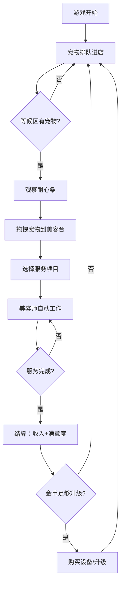

## 1. 产品概述

毛茸茸宠物美容院——一款治愈系经营模拟游戏。玩家经营一家宠物美容店，接待各种猫猫狗狗，安排美容师为它们提供洗澡、造型、SPA等服务，管理耐心条、赚取金币和口碑，购买设备升级店面。

- 随机生成不同品种、性格和毛发状况的宠物排队进店
- 拖拽宠物到美容台，选择服务项目，美容师自动工作
- 完成服务收取费用，宠物满意度影响口碑，攒钱购买新设备

## 2. 核心功能

### 2.1 功能模块

1. **游戏主页面**：宠物等候区（队列+耐心条）、美容工作台区、状态栏（金币/口碑/等级）、设备升级商店

### 2.2 页面详情

| 页面名称 | 模块名称 | 功能描述 |
|---------|---------|---------|
| 游戏主页面 | 宠物等候区 | 左侧展示排队中的宠物，每个宠物显示品种图标、名称、耐心条、毛发脏度指示 |
| 游戏主页面 | 美容工作台 | 中央区域显示2-4个美容台（可升级增加），每个台位显示当前宠物、服务进度、美容师状态 |
| 游戏主页面 | 服务选择面板 | 拖拽宠物到美容台后弹出，可选洗澡/造型/SPA，不同服务耗时和价格不同 |
| 游戏主页面 | 状态栏 | 顶部显示金币数量、口碑评分、店铺等级、已服务宠物数 |
| 游戏主页面 | 设备升级商店 | 右侧或底部面板，可购买新美容台、高级浴缸、专业剪刀等设备 |
| 游戏主页面 | 宠物满意度结算 | 服务完成后弹出结算卡片，显示服务收入、满意度评分、口碑变化 |

## 3. 核心流程

玩家开始游戏 → 宠物自动排队出现在等候区（随机品种/性格/脏度） → 观察耐心条，优先处理急躁宠物 → 拖拽宠物到空闲美容台 → 选择服务项目 → 美容师自动工作（进度条推进） → 服务完成弹出结算 → 收取金币、计算满意度（根据耐心剩余比例） → 满意加口碑，不满意扣分 → 攒够金币购买新设备/升级 → 循环经营

## 4. 用户界面设计

### 4.1 设计风格

- **主题**：温馨日系治愈风，柔和暖色调，圆润可爱的UI元素
- **主色**：`#FFF5E6`（奶油暖白）、`#FF9A76`（珊瑚橙）
- **辅助色**：`#FFECD2`（浅杏色）、`#7EC8A0`（薄荷绿）、`#F8C8DC`（粉樱色）、`#6C9BCF`（天蓝色）
- **字体**：标题用 Nunito（圆润可爱），正文用 Nunito Sans
- **按钮**：大圆角（16px），柔和阴影，hover时轻微弹跳
- **布局**：上方状态栏，左侧宠物等候区，中央美容台区，底部/右侧升级商店
- **宠物图标**：用emoji+CSS绘制的可爱猫狗头像，不同品种不同颜色
- **动画**：耐心条渐变闪烁警告、服务进度条流畅推进、金币飘落动画、满意度星星弹出

### 4.2 页面设计概览

| 页面名称 | 模块名称 | UI元素 |
|---------|---------|--------|
| 游戏主页面 | 状态栏 | 顶部横向条，左侧金币图标+数量，中间口碑星星，右侧等级徽章 |
| 游戏主页面 | 宠物等候区 | 左侧竖向排列的宠物卡片，每张卡片含宠物emoji、品种名、耐心条（绿→黄→红渐变）、脏度星星 |
| 游戏主页面 | 美容工作台 | 中央2-4个圆形/圆角矩形台位，空闲时虚线框+加号，工作中显示宠物+进度环+美容师动画 |
| 游戏主页面 | 服务选择面板 | 点击美容台弹出的浮动卡片，三个服务选项卡片（洗澡💧/造型✂️/SPA🧴），显示耗时和价格 |
| 游戏主页面 | 设备升级商店 | 底部横滑卡片列表，每个设备卡片含图标、名称、价格、购买按钮 |

### 4.3 响应式

- 桌面优先设计，1280px+最佳体验
- 中等屏幕（768-1280px）升级商店折叠为底部抽屉
- 小屏幕（<768px）等候区改为顶部横滑，美容台纵向排列

### 4.4 游戏数据设计

**宠物品种**：
- 猫咪：橘猫、英短、布偶、暹罗、缅因
- 狗狗：柯基、金毛、柴犬、泰迪、哈士奇

**宠物性格**：
- 乖巧型：耐心条消耗慢（1x）
- 普通型：正常消耗（1.5x）
- 急躁型：消耗快（2.5x）

**服务项目**：
- 洗澡💧：耗时8秒，收费30金币
- 造型✂️：耗时15秒，收费60金币
- SPA🧴：耗时25秒，收费100金币

**满意度计算**：
- 基于服务完成时耐心剩余比例：剩余>60% = 非常满意（+3口碑），30-60% = 满意（+1口碑），<30% = 不满意（-2口碑）

**设备升级**：
- 新增美容台：200金币（最多4个）
- 高级浴缸：150金币（洗澡速度+30%）
- 专业剪刀：200金币（造型速度+30%）
- SPA套装：300金币（SPA速度+30%）
- 耐心零食：100金币（所有宠物耐心+20%）
