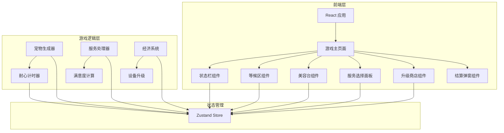

## 1. 架构设计



## 2. 技术说明

- **前端**：React@18 + TypeScript + Tailwind CSS + Vite
- **初始化工具**：已有项目，直接复用 vite-init react-ts 模板结构
- **后端**：无（纯前端项目）
- **状态管理**：Zustand
- **渲染方案**：React DOM + CSS 动画 + Tailwind
- **图标**：lucide-react + emoji

## 3. 路由定义

| 路由 | 用途 |
|------|------|
| / | 游戏主页面 |

## 4. 核心模块设计

### 4.1 游戏数据类型

```typescript
type PetSpecies = "orange_cat" | "british_shorthair" | "ragdoll" | "siamese" | "maine_coon" | "corgi" | "golden_retriever" | "shiba" | "poodle" | "husky"
type PetTemperament = "calm" | "normal" | "impatient"
type ServiceType = "bath" | "styling" | "spa"

interface Pet {
  id: string
  species: PetSpecies
  name: string
  emoji: string
  temperament: PetTemperament
  patienceMax: number
  patienceCurrent: number
  dirtyLevel: number
  arrivedAt: number
}

interface GroomingStation {
  id: string
  petId: string | null
  serviceType: ServiceType | null
  progress: number
  isWorking: boolean
}

interface Equipment {
  id: string
  name: string
  description: string
  price: number
  effect: string
  purchased: boolean
}

interface GameState {
  coins: number
  reputation: number
  level: number
  petsServed: number
  queue: Pet[]
  stations: GroomingStation[]
  equipments: Equipment[]
  petSpawnRate: number
}
```

### 4.2 游戏逻辑模块

```
src/utils/gameLogic.ts
- generateRandomPet(): 随机生成宠物（品种/性格/脏度/耐心值）
- calculateSatisfaction(patienceRemaining: number): 计算满意度等级
- calculateServiceTime(serviceType, equipments): 根据设备计算实际服务时间
- calculateServicePrice(serviceType): 返回服务价格
- getSpeciesInfo(species): 返回品种信息（名称/emoji/类型）
- getTemperamentMultiplier(temperament): 返回耐心消耗倍率
```

### 4.3 状态管理

```typescript
interface GameStore {
  coins: number
  reputation: number
  level: number
  petsServed: number
  queue: Pet[]
  stations: GroomingStation[]
  equipments: Equipment[]
  isPaused: boolean
  selectedStationId: string | null
  showSettlement: { stationId: string; pet: Pet; service: ServiceType; coins: number; satisfaction: string; reputationChange: number } | null
  
  addPetToQueue: (pet: Pet) => void
  assignPetToStation: (petId: string, stationId: string) => void
  selectService: (stationId: string, serviceType: ServiceType) => void
  updateStationProgress: () => void
  completeService: (stationId: string) => void
  removeExpiredPet: (petId: string) => void
  purchaseEquipment: (equipmentId: string) => void
  tickPatience: () => void
  togglePause: () => void
  resetGame: () => void
}
```

### 4.4 组件结构

```
src/
  pages/
    GamePage.tsx              游戏主页面
  components/
    StatusBar.tsx             顶部状态栏（金币/口碑/等级）
    WaitingQueue.tsx          左侧宠物等候区
    PetCard.tsx               单个宠物卡片（拖拽源）
    GroomingStation.tsx       单个美容台（拖拽目标）
    ServicePanel.tsx          服务选择面板
    UpgradeShop.tsx           设备升级商店
    SettlementPopup.tsx       服务结算弹窗
    GameOverScreen.tsx        游戏结束画面（口碑<=0）
  hooks/
    useGameLoop.ts            游戏主循环（requestAnimationFrame）
  utils/
    gameLogic.ts              游戏逻辑计算
    petData.ts                宠物品种数据
  store/
    gameStore.ts              Zustand 游戏状态
```

### 4.5 游戏循环设计

游戏主循环使用 `requestAnimationFrame`，每帧执行：
1. 更新等候区所有宠物的耐心值（按性格倍率消耗）
2. 更新所有工作中的美容台服务进度
3. 检查耐心耗尽的宠物（移出队列，扣口碑）
4. 检查服务完成的美容台（弹出结算）
5. 按时间间隔生成新宠物加入队列
6. 检查游戏结束条件（口碑≤0）

### 4.6 拖拽交互设计

使用 HTML5 Drag and Drop API：
- `PetCard` 设置 `draggable`，`onDragStart` 记录宠物ID
- `GroomingStation` 设置 `onDragOver` 允许放置，`onDrop` 将宠物分配到台位
- 拖拽时宠物卡片半透明，目标台位高亮闪烁
